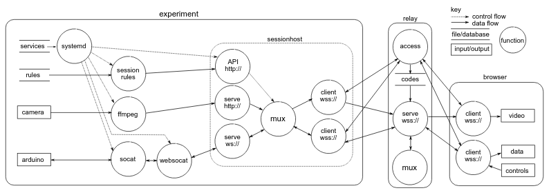

# Cloud Infrastructure

We have developed a custom cloud infrastructure that suits the needs of traditional campus users.

## Features

### Minimal student support requirements

Students need only to obtain a computing device with a modern browser and internet connection. No software or plug-ins are required, minimising the technical support they require from staff.

### Easy interactions with your IT team

Staff wishing to host a new physical experiment on campus need only register an experiment with IT as a "bring your own device" that needs nothing special - just access to surf the web.

### Powerful, flexible booking policies

Our booking system has many features, including 

   - offer a selection of bookable sessions of pre-defined lengths for each user group
   - coordinate periods of exclusive and shared access for multiple user groups
   - configure different user interace options for each user group
   - manage usage and booking quantity per user
   - provide pre-booked sessions to staff and students
   - cancel bookings that are no longer needed, even if they have been started
   - restrict access to defined periods of time
   

An example of a pre-booked session providing two pieces of equipment, one after another during a 2-hour in-class laboratory, to a student.

### Transparent administration

Our servers report live statistics on experiment status.

Experiment software can be updated over the network, without needing physical access.

Booking system configuration is in YAML, with in-built consistency checking.

Bookings can be edited at any time by administrative staff.

## Technical details

Our custom servers are written in golang, a language ideally suited to sustainable cloud computing (1/10th energy usage of equivalent python servers).

Video is relayed over websockets using MPEG-TS format, using the open-source jsmpeg decoder that is written in web-assembly and therefore able to be used by any modern browser without needing plug-ins.

Data and control information is relayed over websockets using JSON message formats.

The student user experience is of the uppermost concern. To suit usage with large classes of hundreds of students, access is strictly limited to the booking holder, and the time slot, yet making bookings is straightforward. The system is based around JWT tokens, which are tracked to permit cancellation of sessions. Unlike many conventional IOT or remote-equipment systems, it is quick to make bookings, and there is no possibility for students to obtain additional access by hitting the back button later or replaying credentials - all credentials passed to the client-side javascript are strictly time-limited.

Reproduced from our [2022 IJMEE paper](https://doi.org/10.1177/03064190221081451) where you can find a more detailed overview of our system.

