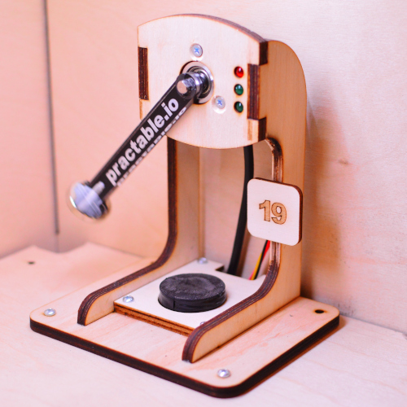
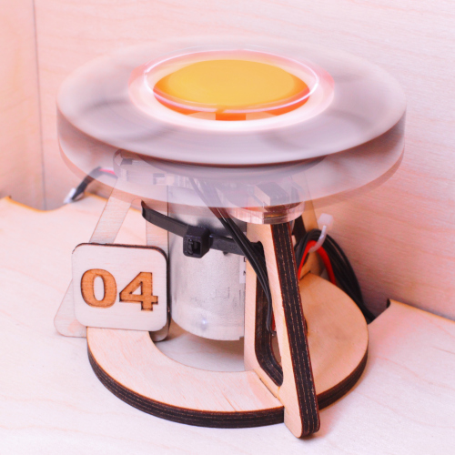
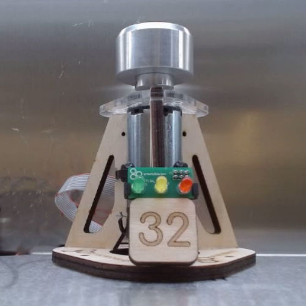
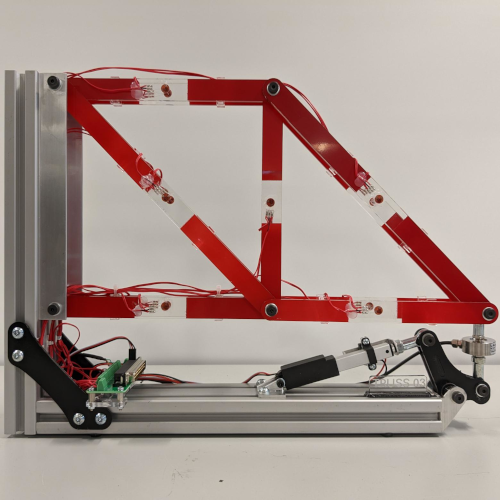
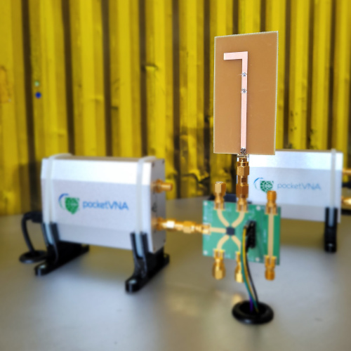
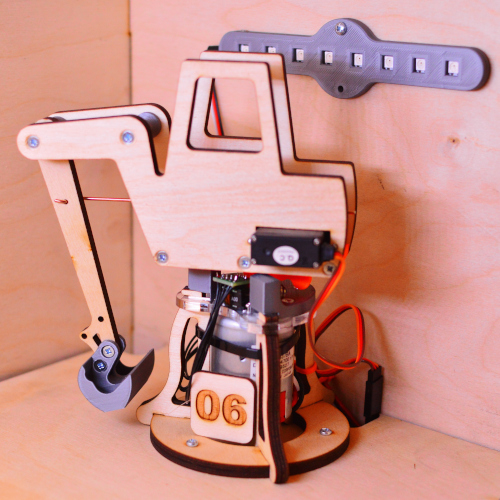
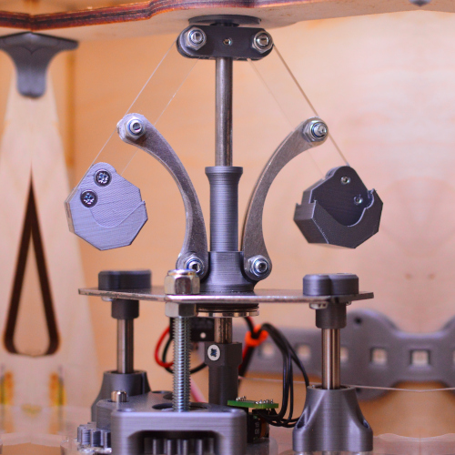
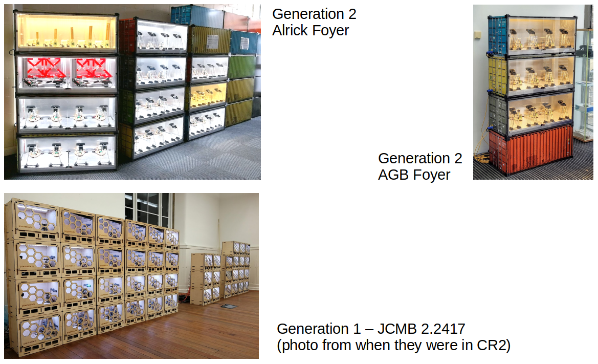

# Experiment Examples

This page shows some example experiments and installations

## Pendulums

Pendulums were our first-ever experiment - they are housed in our first generation wooden boxes, which are straightforward to laser-cut and assemble.

We have over 30 pendulums operating at present. These are used on our first year course to illustrate data sampling, and in outreach to demonstrate our innovative teaching.

## Spinners

Spinners were our second-ever experiment, and we have versions in our first generation wooden boxes, and also in our second generation metal containers.

The first generation use a relatively inexpensive DC motor and laser cut weights, and demonstrates the effects of friction on steady state error in control systems.

We have 10 generation one spinners, each with a different weight disk.

The second generation use a low-friction DC motor and precision-turned weights to demonstrate near-ideal first and second order systems.

We have 48 generation two spinners, with 12 different weight disks (i.e. four of each disk).

## Trusses

Our trusses comprise six members made of acrylic beams, with integrated strain gauages, and a linear actuator to load the truss at the far end. Students can explore the tension or compression that develops in each member under load.

## Vector Network Analysers

Our automated system allows students to perform a fresh one-port calibration whenever they desire. The experiments contain a transmission line, so students can explore the impedance as a function of length.

We have five one-port VNA experiments, each with a different length transmission line.

## Diggers

We have 10 diggers, illustrating position control under varying angular inertia.

## Governors

We have 10 governers, illustrating velocity control under varying angular inertia. 

## Installations

Our experiments are typically hosted in public foyers, enhancing building entraces with a "science museum" feel. This avoids taking other resarch or teaching lab space, increases the visibility of teaching activities, engages visitors, and provides students with an opportunity to see the experiments up close, if they wish. 

